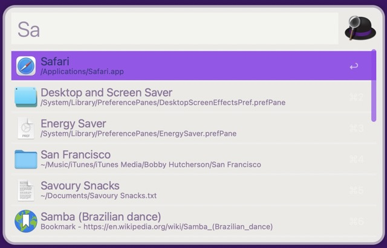

# Alfred-ColormindMe
An Alfred workflow to generate a random theme based on [Colormind.io](http://colormind.io) API.

[Colormind.io](http://colormind.io) is a AI powered color scheme generator that uses deep learning to generate color palettes.

## Usage
Just type `cm` on Alfred and select `Get Random Theme` to generate a random theme.  

Once it`s done, it will show the generated theme on finder with the filename random.alfredappearance. Just open this file to import the theme to Alfred.

>The first time you run the workflow it will ask you to set a destination folder to the generated themes.

Here are some examples of the generated themes:  

## Download
Check the [releases page](https://github.com/gohoyer/Alfred-ColormindMe/releases) to download it.